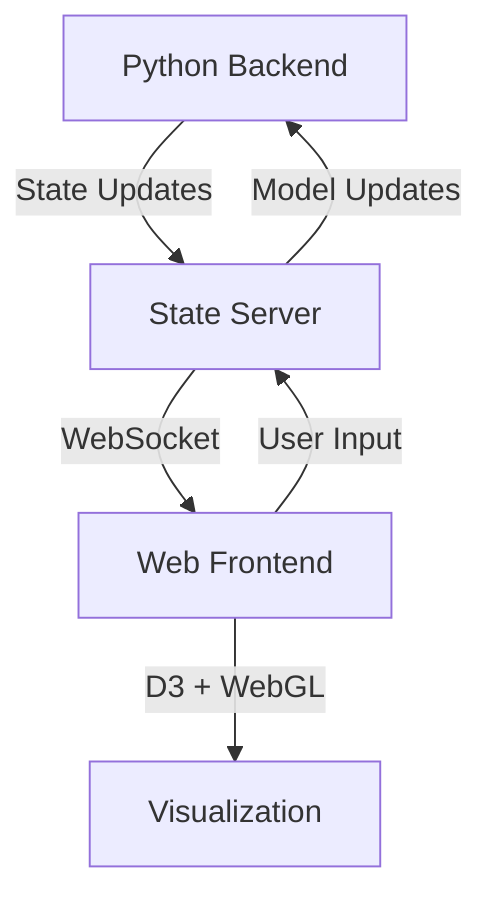

# Variational Inference Visualization System

## Overview

This document specifies a real-time visualization system for variational inference in probabilistic graphical models. The system visualizes:
- Forward (p_θ) and backward (q_φ) distributions
- KL divergence between distributions
- ELBO computation flow
- Message passing and gradient updates
- Multiple observed (X) and latent (Z) variables

## 1. Core Architecture

### 1.1 System Components


### 1.2 State Schema
```typescript
interface SystemState {
  nodes: {
    [nodeId: string]: Node;
  };
  edges: Edge[];
  optimization: OptimizationState;
  viewport: ViewportState;
}

interface Node {
  id: string;
  type: 'observed' | 'latent';
  numStates: number;
  position: Vec2;
  distributions: {
    p_theta: Distribution;
    q_phi: Distribution;
  };
}

interface Distribution {
  values: number[];  // Probability values
  parents: string[]; // Parent node IDs
  type: 'categorical' | 'gaussian';
}

interface OptimizationState {
  step: number;
  elbo: number;
  klDivergence: number;
  learningRate: number;
  history: OptimizationStep[];
}
```

### 1.3 Communication Protocol
```typescript
// WebSocket message types
type Message = 
  | { type: 'STATE_UPDATE'; payload: SystemState }
  | { type: 'USER_INTERACTION'; payload: UserAction }
  | { type: 'OPTIMIZATION_STEP'; payload: OptimizationStep }
```

## 2. Distribution Visualization

### 2.1 Node Renderer
```javascript
class NodeRenderer {
  constructor(canvas, node) {
    this.ctx = canvas.getContext('2d');
    this.node = node;
    this.config = {
      radius: 40,
      barWidth: 5,
      colors: {
        p_theta: '#1f77b4',
        q_phi: '#d62728'
      }
    };
  }

  drawDistributions() {
    // Draw p_theta (outer ring)
    this.drawDistribution('p_theta', 1.0);
    // Draw q_phi (inner ring)
    this.drawDistribution('q_phi', 0.8);
  }

  drawDistribution(type, scale) {
    const values = this.node.distributions[type].values;
    const angleStep = (2 * Math.PI) / values.length;
    
    values.forEach((prob, i) => {
      const angle = i * angleStep;
      const height = prob * this.config.radius * scale;
      
      this.ctx.beginPath();
      this.ctx.fillStyle = this.config.colors[type];
      // Draw probability bar at angle
      this.ctx.moveTo(
        Math.cos(angle) * this.config.radius,
        Math.sin(angle) * this.config.radius
      );
      this.ctx.lineTo(
        Math.cos(angle) * (this.config.radius + height),
        Math.sin(angle) * (this.config.radius + height)
      );
      this.ctx.arc(0, 0, this.config.radius + height, 
                   angle - 0.1, angle + 0.1);
      this.ctx.fill();
    });
  }
}
```

### 2.2 KL Divergence Display
```javascript
class KLDivergenceVisualizer {
  constructor(container) {
    this.svg = d3.select(container)
      .append('svg')
      .attr('class', 'kl-display');
    
    this.scale = d3.scaleLinear()
      .domain([0, 1])
      .range(['#fff', '#f00']);
  }

  update(p, q) {
    const kl = this.computeKL(p, q);
    
    // Update heatmap cell
    this.svg.select('.kl-cell')
      .style('fill', this.scale(kl))
      .attr('data-value', kl.toFixed(4));
  }

  computeKL(p, q) {
    return p.reduce((sum, pi, i) => {
      const qi = q[i];
      return sum + (pi * Math.log(pi / qi));
    }, 0);
  }
}
```

## 3. Message Passing Visualization

### 3.1 Particle System
```javascript
class MessageParticleSystem {
  constructor(gl) {
    this.gl = gl;
    this.particles = [];
    
    // Initialize WebGL buffers and shaders
    this.initBuffers();
    this.initShaders();
  }

  initBuffers() {
    // Position buffer
    this.positionBuffer = this.gl.createBuffer();
    this.gl.bindBuffer(this.gl.ARRAY_BUFFER, this.positionBuffer);
    
    // Velocity buffer
    this.velocityBuffer = this.gl.createBuffer();
    this.gl.bindBuffer(this.gl.ARRAY_BUFFER, this.velocityBuffer);
  }

  // Vertex shader for particles
  static vertexShader = `
    attribute vec2 position;
    attribute vec2 velocity;
    uniform float deltaTime;
    
    void main() {
      vec2 newPosition = position + velocity * deltaTime;
      gl_Position = vec4(newPosition, 0.0, 1.0);
      gl_PointSize = 2.0;
    }
  `;

  update(deltaTime) {
    this.gl.useProgram(this.program);
    this.gl.uniform1f(this.deltaTimeLocation, deltaTime);
    
    // Update particle positions
    this.gl.bindBuffer(this.gl.ARRAY_BUFFER, this.positionBuffer);
    this.gl.vertexAttribPointer(0, 2, this.gl.FLOAT, false, 0, 0);
    
    this.gl.drawArrays(this.gl.POINTS, 0, this.particles.length);
  }
}
```

### 3.2 Message Flow Controller
```javascript
class MessageFlowController {
  constructor(particleSystem) {
    this.particleSystem = particleSystem;
    this.messageQueue = [];
  }

  sendMessage(from, to, type) {
    const numParticles = type === 'gradient' ? 100 : 20;
    
    for (let i = 0; i < numParticles; i++) {
      this.particleSystem.addParticle({
        position: from.position,
        target: to.position,
        type: type
      });
    }
  }

  update(deltaTime) {
    // Process message queue
    while (this.messageQueue.length > 0) {
      const msg = this.messageQueue.shift();
      this.sendMessage(msg.from, msg.to, msg.type);
    }
    
    this.particleSystem.update(deltaTime);
  }
}
```

## 4. ELBO Computation Visualization

### 4.1 ELBO Flow Diagram
```javascript
class ELBOVisualizer {
  constructor(container) {
    this.svg = d3.select(container)
      .append('svg')
      .attr('class', 'elbo-flow');
    
    this.layout = {
      width: 600,
      height: 400,
      margin: { top: 20, right: 20, bottom: 30, left: 40 }
    };
  }

  drawFlow(elboComponents) {
    const components = [
      { label: 'Reconstruction', value: elboComponents.reconstruction },
      { label: 'KL Divergence', value: elboComponents.kl },
      { label: 'Total ELBO', value: elboComponents.total }
    ];

    // Create stacked bar chart
    const bars = this.svg.selectAll('.elbo-component')
      .data(components)
      .join('rect')
      .attr('class', 'elbo-component')
      .attr('x', d => this.xScale(d.label))
      .attr('y', d => this.yScale(d.value))
      .attr('height', d => this.yScale(0) - this.yScale(d.value))
      .attr('width', this.xScale.bandwidth());
  }
}
```

### 4.2 Sample Path Tracer
```javascript
class SamplePathTracer {
  constructor(svg) {
    this.svg = svg;
    this.paths = [];
  }

  traceSample(sample) {
    const path = this.svg.append('path')
      .attr('class', 'sample-path')
      .attr('d', this.generatePathData(sample))
      .style('opacity', 0)
      .transition()
      .duration(1000)
      .style('opacity', 1)
      .transition()
      .duration(500)
      .style('opacity', 0)
      .remove();
    
    this.paths.push(path);
  }

  generatePathData(sample) {
    // Generate SVG path data for sample trajectory
    return `M ${sample.start.x} ${sample.start.y} 
            Q ${sample.control.x} ${sample.control.y}
              ${sample.end.x} ${sample.end.y}`;
  }
}
```

## 5. Multi-Node Layout

### 5.1 Force-Directed Layout
```javascript
class GraphLayout {
  constructor() {
    this.simulation = d3.forceSimulation()
      .force('link', d3.forceLink().id(d => d.id))
      .force('charge', d3.forceManyBody().strength(-300))
      .force('center', d3.forceCenter())
      .force('collision', d3.forceCollide(70));
  }

  updateLayout(nodes, edges) {
    this.simulation.nodes(nodes);
    this.simulation.force('link').links(edges);
    
    // Separate observed and latent nodes
    this.simulation.force('y', d3.forceY().strength(d => {
      return d.type === 'observed' ? 0.1 : -0.1;
    }));
    
    this.simulation.alpha(1).restart();
  }
}
```

### 5.2 Node Clustering
```javascript
class NodeClusterer {
  constructor(nodes) {
    this.nodes = nodes;
    this.clusters = new Map();
  }

  clusterByType() {
    return d3.group(this.nodes, d => d.type);
  }

  getClusterCenter(cluster) {
    const positions = cluster.map(n => n.position);
    return {
      x: d3.mean(positions, p => p.x),
      y: d3.mean(positions, p => p.y)
    };
  }
}
```

## 6. Interaction System

### 6.1 Control Panel
```javascript
class ControlPanel {
  constructor(container) {
    this.container = container;
    this.controls = new Map();
    
    this.initializeControls();
  }

  initializeControls() {
    // Learning rate slider
    this.addSlider({
      id: 'learning-rate',
      label: 'Learning Rate',
      min: 0.001,
      max: 0.1,
      step: 0.001,
      default: 0.01
    });

    // Number of samples slider
    this.addSlider({
      id: 'num-samples',
      label: 'Number of Samples',
      min: 10,
      max: 1000,
      step: 10,
      default: 100
    });
  }

  addSlider(config) {
    const control = document.createElement('div');
    control.innerHTML = `
      <label for="${config.id}">${config.label}</label>
      <input type="range" 
             id="${config.id}"
             min="${config.min}"
             max="${config.max}"
             step="${config.step}"
             value="${config.default}">
      <span class="value">${config.default}</span>
    `;
    
    this.container.appendChild(control);
    this.controls.set(config.id, control);
  }
}
```

### 6.2 Timeline Scrubber
```javascript
class TimelineScrubber {
  constructor(container) {
    this.container = container;
    this.currentStep = 0;
    this.history = [];
    
    this.initializeScrubber();
  }

  initializeScrubber() {
    const scrubber = document.createElement('div');
    scrubber.className = 'timeline-scrubber';
    
    this.slider = document.createElement('input');
    this.slider.type = 'range';
    this.slider.min = 0;
    this.slider.max = 100;
    this.slider.value = 0;
    
    scrubber.appendChild(this.slider);
    this.container.appendChild(scrubber);
    
    this.slider.addEventListener('input', this.onScrub.bind(this));
  }

  onScrub(event) {
    const step = parseInt(event.target.value);
    this.currentStep = step;
    this.emit('timelineUpdate', this.history[step]);
  }
}
```

## 7. Performance Optimization

### 7.1 WebGL Renderer
```javascript
class WebGLRenderer {
  constructor(canvas) {
    this.gl = canvas.getContext('webgl2');
    this.programs = new Map();
    
    this.initializeShaders();
  }

  initializeShaders() {
    // Particle system shader
    this.addProgram('particles', {
      vertex: `
        #version 300 es
        in vec2 position;
        in vec2 velocity;
        uniform float deltaTime;
        
        void main() {
          vec2 newPosition = position + velocity * deltaTime;
          gl_Position = vec4(newPosition, 0.0, 1.0);
          gl_PointSize = 2.0;
        }
      `,
      fragment: `
        #version 300 es
        precision highp float;
        out vec4 fragColor;
        
        void main() {
          fragColor = vec4(1.0, 0.5, 0.0, 1.0);
        }
      `
    });
  }

  addProgram(name, shaders) {
    const program = this.gl.createProgram();
    // Compile and link shaders...
    this.programs.set(name, program);
  }
}
```

### 7.2 Worker Thread Management
```javascript
class ComputeWorker {
  constructor() {
    this.worker = new Worker('compute-worker.js');
    this.tasks = new Map();
    
    this.worker.onmessage = this.handleMessage.bind(this);
  }

  handleMessage(event) {
    const { taskId, result } = event.data;
    const task = this.tasks.get(taskId);
    
    if (task) {
      task.resolve(result);
      this.tasks.delete(taskId);
    }
  }

  computeKL(p, q) {
    const taskId = Math.random().toString(36);
    
    return new Promise((resolve, reject) => {
      this.tasks.set(taskId, { resolve, reject });
      
      this.worker.postMessage({
        type: 'COMPUTE_KL',
        taskId,
        data: { p, q }
      });
    });
  }
}
```

## 8. Testing and Validation

### 8.1 Test Cases
```typescript
interface TestCase {
  name: string;
  input: {
    p_theta: number[];
    q_phi: number[];
    observed: number[];
  };
  expected: {
    kl: number;
    elbo: number;
  };
}

const TEST_CASES: TestCase[] = [
  {
    name: "Simple Binary Variable",
    input: {
      p_theta: [0.3, 0.7],
      q_phi: [0.4, 0.6],
      observed: [1]
    },
    expected: {
      kl: 0.0207,
      elbo: -0.6931
    }
  }
];
```

### 8.2 Performance Benchmarks
```javascript
class PerformanceMonitor {
  constructor() {
    this.metrics = {
      fps: [],
      frameTime: [],
      memoryUsage: []
    };
  }

  measure() {
    const start = performance.now();
    
    // Measure frame rendering
    requestAnimationFrame(() => {
      const end = performance.now();
      this.metrics.frameTime.push(end - start);
      this.metrics.fps.push(1000 / (end - start));
      
      // Trim history
      if (this.metrics.fps.length > 100) {
        this.metrics.fps.shift();
        this.metrics.frameTime.shift();
      }
    });
  }

  getAverageFPS() {
    return d3.mean(this.metrics.fps);
  }
}
```

## 9. Error Handling

### 9.1 Error Types
```typescript
enum ErrorCode {
  WEBGL_CONTEXT_LOST = 1001,
  INVALID_DISTRIBUTION = 1002,
  OPTIMIZATION_FAILED = 1003
}

class VisualizationError extends Error {
  constructor(
    public code: ErrorCode,
    public details: any
  ) {
    super(`Visualization Error ${code}: ${details}`);
  }
}
```

### 9.2 Error Recovery
```javascript
class ErrorHandler {
  constructor(visualization) {
    this.visualization = visualization;
    this.recoveryStrategies = new Map();
    
    this.initializeRecoveryStrategies();
  }

  initializeRecoveryStrategies() {
    this.recoveryStrategies.set(
      ErrorCode.WEBGL_CONTEXT_LOST,
      async () => {
        await this.visualization.reinitializeWebGL();
        return true;
      }
    );
  }

  async handleError(error: VisualizationError) {
    const strategy = this.recoveryStrategies.get(error.code);
    
    if (strategy) {
      try {
        const recovered = await strategy();
        if (recovered) {
          console.log(`Recovered from error ${error.code}`);
          return;
        }
      } catch (e) {
        console.error(`Recovery failed for error ${error.code}`);
      }
    }
    
    // If no strategy or recovery failed, fallback to safe mode
    this.visualization.enterSafeMode();
  }
}
```

## 10. Usage Example

```javascript
// Initialize visualization
const viz = new VariationalInferenceViz({
  container: document.getElementById('viz-container'),
  width: 800,
  height: 600
});

// Create nodes
const Z = viz.addNode({ type: 'latent', numStates: 2 });
const X = viz.addNode({ type: 'observed', numStates: 2 });

// Set initial distributions
viz.setDistribution(Z, 'p_theta', [0.5, 0.5]);
viz.setDistribution(Z, 'q_phi', [0.5, 0.5]);

// Start optimization
viz.startOptimization({
  learningRate: 0.01,
  numSteps: 100,
  batchSize: 10
});

// Listen for updates
viz.on('optimizationStep', (state) => {
  console.log(`Step ${state.step}: ELBO = ${state.elbo}`);
});
```

## 11. Implementation Notes

1. The system uses WebGL for particle animations and D3.js for static visualizations
2. All probability computations are done in log space for numerical stability
3. The layout algorithm automatically separates observed and latent variables
4. Performance monitoring adjusts particle count based on frame rate
5. Error recovery attempts to preserve optimization state where possible
